## springboot


### 1.springboot 基础回顾

> Build Anything with Spring BootғSpring Boot is the starting point for building all Spring-based applications. Spring Boot is designed to get you up and running as quickly as possible, with minimal upfront configuration of Spring.


#### 1.1 约定优于配置（快速使用springboot）

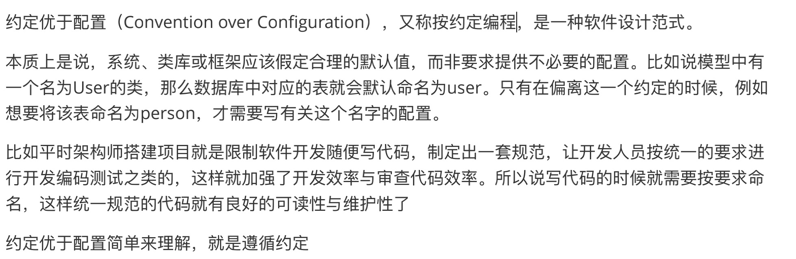

#### 1.2 spring的缺点 & springboot的解决方案

- 缺点1: **配置繁琐构建spring 的xml配置文件需要大量的配置。**

> springboot使用**自动配置**，会将一些配置类的bean注册进ioc。可以直接使用
>
> 表现为我们只要引入我们需要的jar包，相关的配置我们不需要关心，springboot会自动注册这些bean

- 缺点2:**项目管理繁琐，在搭建环境时需要分析导入哪些jar包。容易出现版本不兼容的问题**

>springboot使用**起步依赖**，即将一部分提供某种功能的jar包打包起来，**使用时只要引入打包好后的坐标**。并提供某一类的功能


#### 1.3 单元测试与热部署

- 单元测试

1. 添加jar包

```xml
<dependency> 
  <groupId>org.springframework.boot</groupId> 
  <artifactId>spring-boot-starter-test</artifactId> 
  <scope>test</scope>
</dependency>
```

2. 编写测试代码

```java
@RunWith(SpringRunner.class) //测试启动类，并加载springboot测试注解
@SpringBootTest //标记为springboot测试类 并加载ApplicationContent上下文环境
class SpringbootDemoApplicationTests {
  @Autowired
  private DemoController demoController;
  @Test
  public void contextLoads() {
      testSomeThing();
   }
}
```

- 热部署

1. 添加热部署依赖

```xml
<dependency> 
  <groupId>org.springframework.boot</groupId> 
  <artifactId>spring-boot-devtools</artifactId>
</dependency>
```

#### 1.4 全局配置文件

##### 1.4.1 application.properties

kay-value形式。

- @ConfigurationProperties(prefix = "person")将配置文件中以person开头的属性通过setXXX()方法注入到实体的属性中（**类上需要添加@Component注解，只有这样ConfigurationProperties注解才能生效**）
- 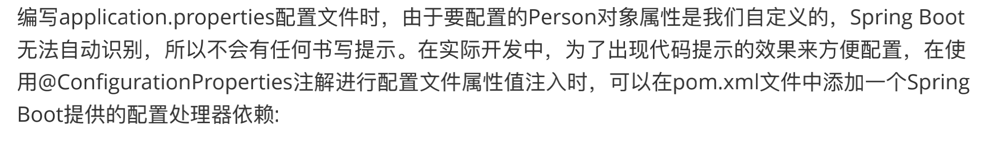

```xml
<dependency> 
  <groupId>org.springframework.boot</groupId> 
  <artifactId>spring-boot-configuration-processor</artifactId> 
  <optional>true</optional>
</dependency>
```

##### 1.4.2  **application.yaml**

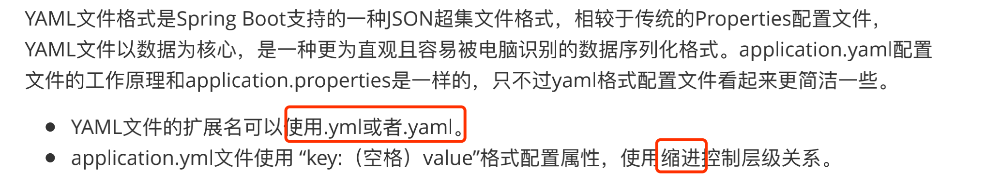

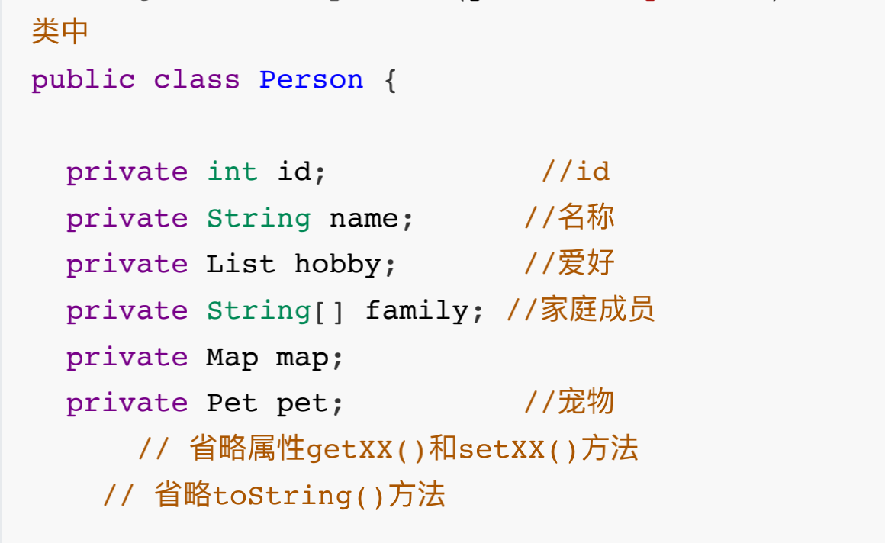

对以上对象设置属性可以在yml文件中添加设置

```yaml
person:
 id: 1
 name: lucy
 hobby: [游泳，篮球]
 family: [father,mother]
 map: {k1: v1,k2: v2}
 pet: {type: dog,name: 旺财}
```


#### 1.5  @ConfigurationProperties & @Value

属性文件有配置 person.id=111

@ConfigurationProperties

```java
@Component
@ConfigurationProperties(prefix = "person")
public class Person {
		private int id; 
  
    public void setId(int id) {
        this.id = id;
     }
}
```

@Value

```java
@Component
public class Person {
  
    @Value("${person.id}")
    private int id; 
}
```


#### 1.6 **@PropertySource**自定义配置文件

```java
//自定义配置类
@Configuration 
//指定配置文件
@PropertySource("classpath:test.properties") 
//开启对配置类的数据注入功能，如果是@Component注解的类，可以省略
@EnableConfigurationProperties(MyProperties.class) 
//执行配置下项前缀
@ConfigurationProperties(prefix = "test") 
public class MyProperties {
    private int id;
    private String name;
 }
```

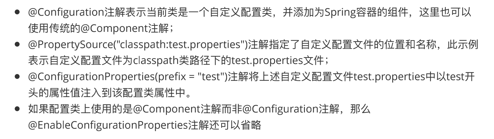


#### 1.7 @Configuration & @Bean

```java
@Configuration // 定义该类是一个配置类
public class MyConfig {
    @Bean //将返回值对象作为组件添加到spring ioc容器中，该组件的id默认为方法名
    public MyService myService(){
    return new MyService();
     }
}
```


#### 1.8 随机数 & 参数间引用

- 随机数

```properties
my.secret=${random.value}  //配置随机数
my.number=${random.int} 	//配置随机整数
my.bignumber=${random.long} //配置随机long类型数
my.uuid=${random.uuid} //配置随机uuid类型数
my.number.less.than.ten=${random.int(10)} //配置小于10的随机整数 
my.number.in.range=${random.int[1024,65536]} //配置1024,65536之间的正整数
```

- 参数间引用

```properties
app.name=MyApp
app.description=${app.name} is a Spring Boot application
```


### 2.Springboot 原理深入与源码解析

#### 2.1 springboot自动配置分析

**概念：**

> 能够在添加jar包依赖的时候，自动配置一些组件的相关配置，我们无需或者只需少量配置就能运行编写的项目

**springboot是怎么自动配置的，都把哪些组件进行了自动的配置**

##### 2.1.1 @SpringBootApplication注解

**`@SpringBootApplication` = (默认属性)+`@Configuration` + `@EnableAutoConfiguration` + `@ComponentScan`。**

>```java
>@Target({ElementType.TYPE}) 
>@Retention(RetentionPolicy.RUNTIME)
>@Documented 
>@Inherited 
>//标记该类为配置类
>@SpringBootConfiguration 
>//启动自动配置功能
>@EnableAutoConfiguration 
>//包扫描
>@ComponentScan(
>  excludeFilters = {@Filter(
>type = FilterType.CUSTOM,
>classes = {TypeExcludeFilter.class}
>), @Filter(
>type = FilterType.CUSTOM,
>classes = {AutoConfigurationExcludeFilter.class}
>)}
>)
>public @interface SpringBootApplication {
>...
>}
>```

所以项目主程序类也可以改写成

```java
@Configuration
@EnableAutoConfiguration
@ComponentScan
public class Application {
    public static void main(String[] args) {
        SpringApplication.run(Application.class, args);
    }
}
```


##### 2.1.2 @SpringBootConfiguration 

```java
@Target({ElementType.TYPE})
@Retention(RetentionPolicy.RUNTIME)
@Documented
@Configuration //标记为配置类
public @interface SpringBootConfiguration {
}
```

**本质就是@Configuration** 都是标示该类是一个配置类，只不过就是被springboot进行了封装和命名


##### 2.1.3 @**EnableAutoConfiguration**

@EnableAutoConfiguration

```java
@Target(ElementType.TYPE)
@Retention(RetentionPolicy.RUNTIME)
@Documented
@Inherited
@AutoConfigurationPackage
//使用@Import来收集并注册特定场景相关的bean，并加载到ioc容器中
@Import(AutoConfigurationImportSelector.class)
public @interface EnableAutoConfiguration {
}
```

- @AutoConfigurationPackage

> **作用就是将被@SpringBootApplication（主程序类）注解修饰的类所在包以及子包下所有的组件进行扫描并注册到容器中**，这就是为什么主程序类需要定义在项目包最外层的位置，这样才能将项目内的组件扫描进去

```java
@Target(ElementType.TYPE)
@Retention(RetentionPolicy.RUNTIME)
@Documented
@Inherited
//导入Registrar类中注册的组件
@Import(AutoConfigurationPackages.Registrar.class)
public @interface AutoConfigurationPackage {

}
```

> @Import(AutoConfigurationPackages.Registrar.class)主要代码

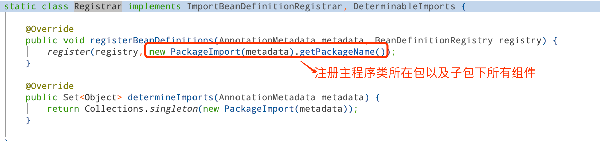

- @Import(AutoConfigurationImportSelector.class)

> 作用：将AutoConfigurationImportSelector类导入到容器中。AutoConfigurationImportSelector 可以将所有被@Configuration配置类都加载到springboot创建并使用的ioc容器中

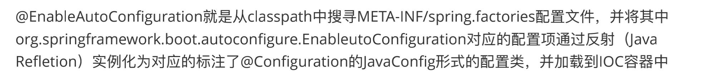

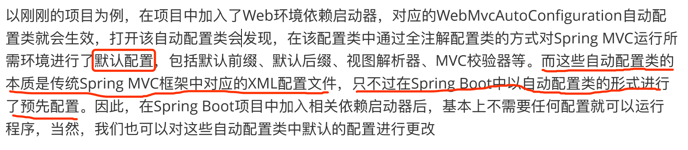

 **总结**

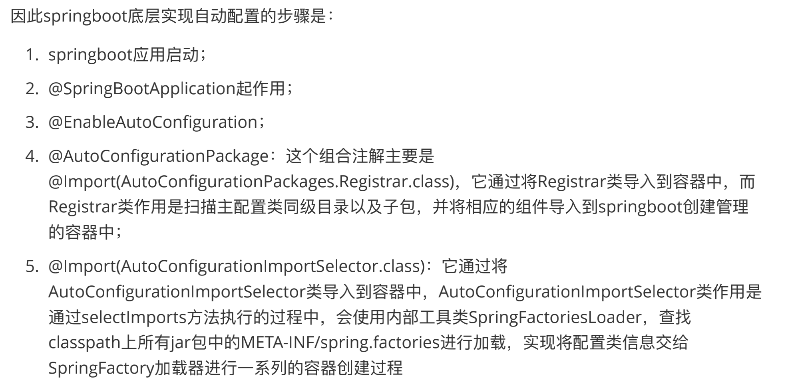

##### 2.1.4 @ComponentScan


####  2.2 SpringApplication run()方法

##### 2.2.1 文字说明

>1） 如果我们使用的是SpringApplication的静态run方法，那么，这个方法里面首先要创建一个SpringApplication对象实例，然后调用这个创建好的SpringApplication的实例方法。在SpringApplication实例初始化的时候，它会提前做几件事情：
>
>- 根据classpath里面是否存在某个特征类`org.springframework.web.context.ConfigurableWebApplicationContext`来决定是否应该创建一个为Web应用使用的ApplicationContext类型。
>- 使用`SpringFactoriesLoader`在应用的classpath中查找并加载所有可用的`ApplicationContextInitializer`。
>- 使用`SpringFactoriesLoader`在应用的classpath中查找并加载所有可用的`ApplicationListener`。
>- 推断并设置main方法的定义类。
>
>2） SpringApplication实例初始化完成并且完成设置后，就开始执行run方法的逻辑了，方法执行伊始，首先遍历执行所有通过`SpringFactoriesLoader`可以查找到并加载的`SpringApplicationRunListener`。调用它们的`started()`方法，告诉这些`SpringApplicationRunListener`，“嘿，SpringBoot应用要开始执行咯！”。
>
>3） 创建并配置当前Spring Boot应用将要使用的Environment（包括配置要使用的PropertySource以及Profile）。
>
>4） 遍历调用所有`SpringApplicationRunListener`的`environmentPrepared()`的方法，告诉他们：“当前SpringBoot应用使用的Environment准备好了咯！”。
>
>5） 如果SpringApplication的showBanner属性被设置为true，则打印banner。
>
>6） 根据用户是否明确设置了`applicationContextClass`类型以及初始化阶段的推断结果，决定该为当前SpringBoot应用创建什么类型的`ApplicationContext`并创建完成，然后根据条件决定是否添加ShutdownHook，决定是否使用自定义的`BeanNameGenerator`，决定是否使用自定义的`ResourceLoader`，当然，最重要的，将之前准备好的Environment设置给创建好的`ApplicationContext`使用。
>
>7） ApplicationContext创建好之后，SpringApplication会再次借助`Spring-FactoriesLoader`，查找并加载classpath中所有可用的`ApplicationContext-Initializer`，然后遍历调用这些`ApplicationContextInitializer`的`initialize`（applicationContext）方法来对已经创建好的`ApplicationContext`进行进一步的处理。
>
>8） 遍历调用所有`SpringApplicationRunListener`的`contextPrepared()`方法。
>
>9） 最核心的一步，将之前通过`@EnableAutoConfiguration`获取的所有配置以及其他形式的IoC容器配置加载到已经准备完毕的`ApplicationContext`。
>
>10） 遍历调用所有`SpringApplicationRunListener`的`contextLoaded()`方法。
>
>11） 调用`ApplicationContext`的`refresh()`方法，完成IoC容器可用的最后一道工序。
>
>12） 查找当前`ApplicationContext`中是否注册有`CommandLineRunner`，如果有，则遍历执行它们。
>
>13） 正常情况下，遍历执行`SpringApplicationRunListener`的`finished()`方法、（如果整个过程出现异常，则依然调用所有`SpringApplicationRunListener`的`finished()`方法，只不过这种情况下会将异常信息一并传入处理）

##### 2.2.2 流程图

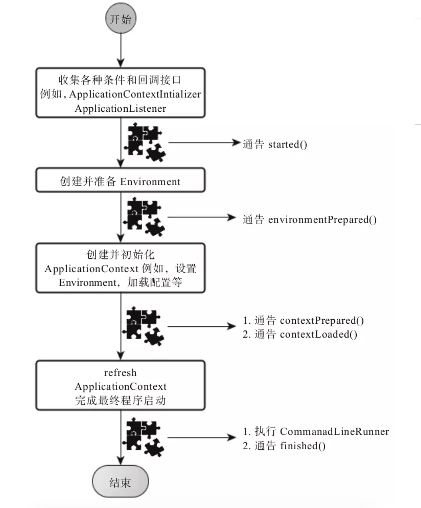


### 3.springboot 数据访问

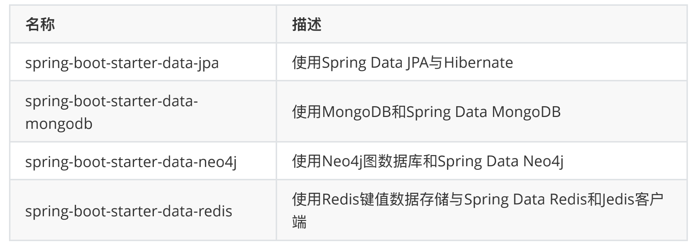

#### 3.1 springboot & mybatis

- 注解方式

```java
@Mapper
public interface CommentMapper {
  @Select("SELECT * FROM t_comment WHERE id =#{id}")
  public Comment findById(Integer id);
}
```

> 添加@Mapper注解，如果文件过多，则可以使用@MapperScan("xxx")批量扫描注解

> 如果数据库和类的命名规则是大写字母改下划线。比如userId对应数据库字段user_id。
>
> 那么在主程序配置文件中添加下面配置，则mybatis会自动匹配到对应的字段并赋值
>
> **mybatis.configuration.map-underscore-to-camel-case=true**

- 配置文件方式

在主程序配置文件中添加mapper xml文件扫描路径

如

```properties
#xml mapper 路径
mybatis.mapper-locations=classpath:mapper/*.xml
#别名
mybatis.type-aliases-package=com.lagou.pojo
```


#### 3.2 springboot & jpa

1. 添加依赖

```xml
<dependency> 
  <groupId>org.springframework.boot</groupId> 
  <artifactId>spring-boot-starter-data-jpa</artifactId>
</dependency>
```

2. 编写实体类

```java
@Entity(name = "t_comment") 
public class Comment {
    @Id 
    @GeneratedValue(strategy = GenerationType.IDENTITY) 
    private Integer id;
    private String content;
    private String author;
    @Column(name = "a_id") 
    private Integer aId;
}
```

3. 编写Repository接口

```java
public interface CommentRepository extends JpaRepository<Comment,Integer> {
}
```


#### 3.3 springboot * redis

1. 添加依赖

```xml
<dependency> 
  <groupId>org.springframework.boot</groupId> 
  <artifactId>spring-boot-starter-data-redis</artifactId>
</dependency>
```

2. 编写实体类

```java
@RedisHash("persons")//表明实体类对象在redis中的存储空间
public class Person {
      @Id //标示实体类主键
      private String id;
      @Indexed //标明实体类属性在redis中生成二级索引
      private String firstname;
      @Indexed
      private String lastname;
      private Address address;
}
```

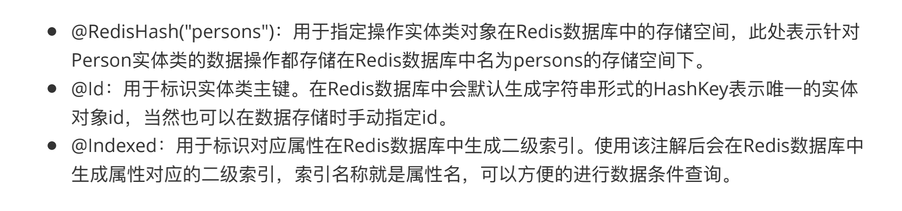

3. 编写Repository接口 **注意继承的是CrudRepository底层操作类**

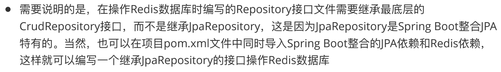


### 4.springboot视图

#### 4.1 Thymeleaf 简介

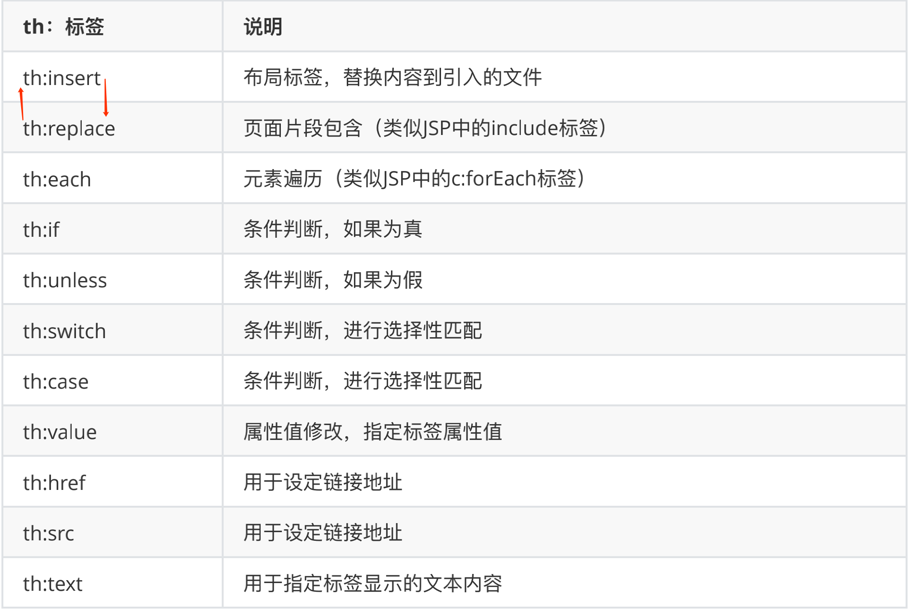

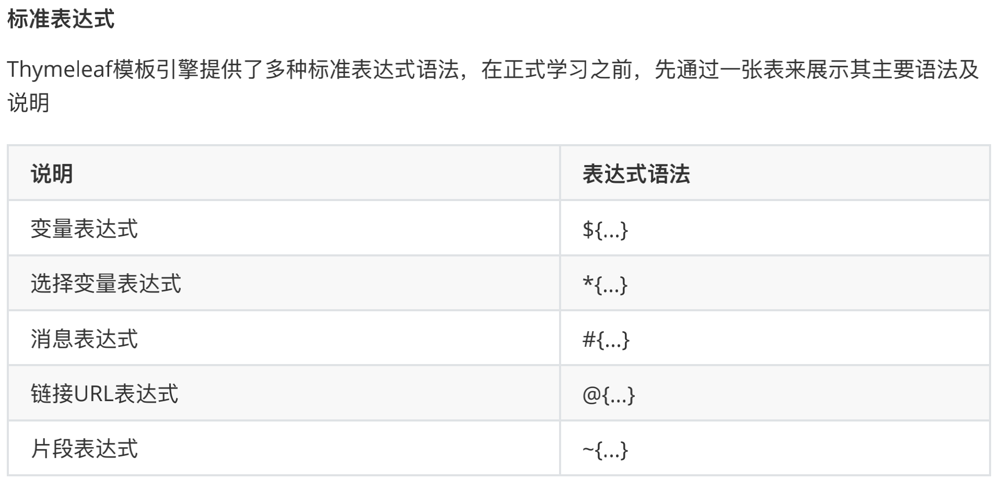


- ${...} 用于获取上下文中的变量值 实例代码

```xml
<!--> 如果上下文中没有title属性的话，则显示test 如果有值则使用属性的值替换<-->
<p th:text="${title}">test</p>
```

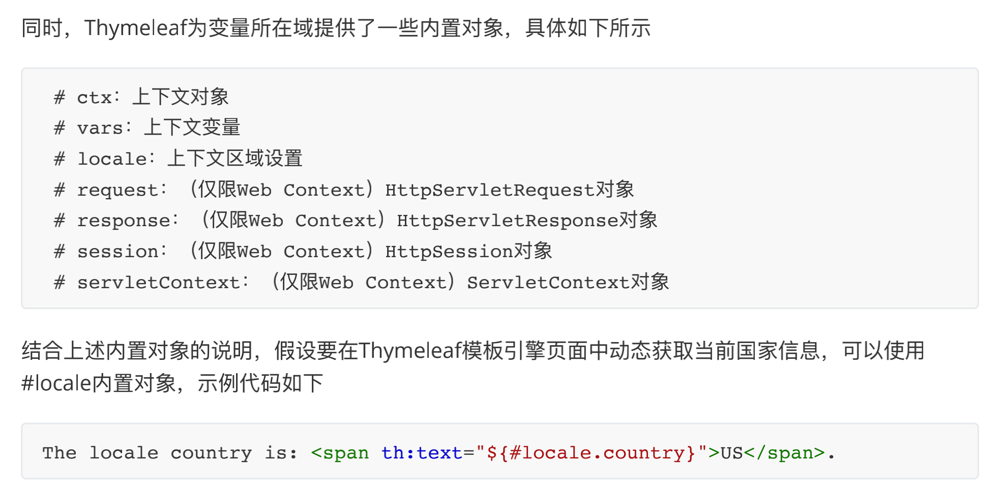

-  ***{...}** 选择变量表达式

```xml
<div th:object="${book}"> 
  <p>titile: <span th:text="*{title}">默认标题</span>.</p>
</div>
<!-->*{title} 表示从book中获取title属性并赋值<-->
```

-  **#{...}** 消息表达式

  消息表达式主要用于Thymeleaf模版页面国际化内容动态替换和展示，结合国际化配置文件使用

- **@{...}** 链接表达式

  一般用于页面的跳转或资源的引入

  ```xml
  <!-->绝对路径写法，参数赋值使用动态表达式${} <-->
  <a th:href="@{http://localhost:8080/order/details(orderId=${o.id})}">view</a>
  <!-->相对路径写法，参数赋值使用动态表达式${} <-->
  <a th:href="@{/order/details(orderId=${o.id})}">view</a>
  ```

  

- **~{...}** 片段表达式

  **用来标记一个模版片段，并根据需要移动或者传递给其他模版**。一般结合 th:insert 或者 th:replace 使用。

  ```xml
  <div th:insert="~{thymeleafDemo::title}"></div>
  <!-->
  	th:insert 将模版插入到div中
  	thymeleafDemo 模版名称 thymeleaf自动到/resources/templates/路径下查找thymeleafDemo模版。
  	title：片段名称
  <-->
  ```

  

#### 4.2 springboot & Thymeleaf 

1. 引入相关依赖

```xml
<dependency> 
  <groupId>org.springframework.boot</groupId> 
  <artifactId>spring-boot-starter-thymeleaf</artifactId>
</dependency>
```

2. 配置相关属性

```properties
spring.thymeleaf.cache = true #启用模版缓存 默认为true 开发阶段一般设置成false
spring.thymeleaf.encoding = UTF-8 #模版编码设置
spring.thymeleaf.mode = HTML5 #应用于模版的模式
spring.thymeleaf.prefix = classpath:/templates/ #模版文件存放路径
spring.thymeleaf.suffix = .html #指定模版文件后缀
```

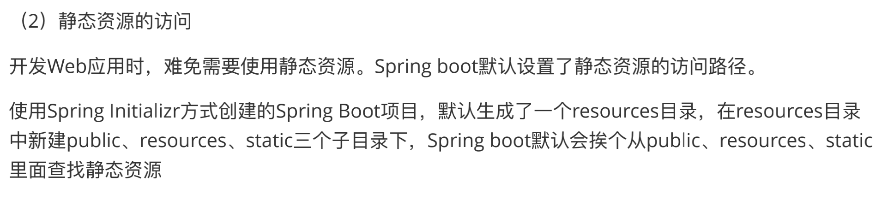

#### 4.3 Thymeleaf国际化

1. 编写多语言国际化配置文件

   在resource路径下创建名称为**i18n** 文件夹，并在该文件夹内根据需要编写对应的多语言国际化文件。

   如login.properties，login_zh_CN.properties，login_en_US.properties

   ```properties
   #login.properties 默认配置文件
   	login.tip=请登录
     login.username=用户名
     login.password=密码
     login.rememberme=记住我
     login.button=登陆
   
    #login_zh_CN.properties 中文配置文件
    	login.tip=请登录
     login.username=用户名
     login.password=密码
     login.rememberme=记住我
     login.button=登陆
   	
   	#login_en_US.properties 
     login.tip=please login
     login.username=user name
     login.password=password
     login.rememberme=remeber me
     login.button=login
   ```

   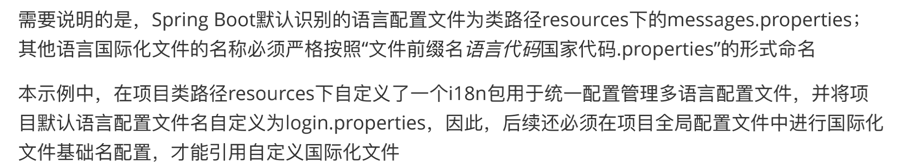

2. 修改配置文件

   ```properties
   # 配置国际化文件基础名
   spring.messages.basename=i18n.login
   ```

   


3. 定制区域信息解析器 (实现LocaleResolver接口)

   ```java
   package com.lagou.config;
   import org.springframework.context.annotation.Bean;
   import org.springframework.context.annotation.Configuration;
   import org.springframework.lang.Nullable;
   import org.springframework.util.StringUtils;
   import org.springframework.web.servlet.LocaleResolver;
   import javax.servlet.http.HttpServletRequest;
   import javax.servlet.http.HttpServletResponse;
   import java.util.Locale;
   
   @Configuration
   public class MyLocaleResovel implements LocaleResolver {
   @Override
   public Locale resolveLocale(HttpServletRequest httpServletRequest) {
         // ឴获取手动切换传递的语言参数，比如l
         String l = httpServletRequest.getParameter("l");
         // ឴获取请求头自动传入的语言参数Accept-Language
         String header = httpServletRequest.getHeader("Accept-Language");
         Locale locale=null;
         // 如果手动传入的为空则按照请求头信息为准，否则以手动传入信息为准
         if(!StringUtils.isEmpty(l)){
         String[] split = l.split("_");
         locale=new Locale(split[0],split[1]);
          }else {
         // Accept-Language: en-US,en;q=0.9,zh-CN;q=0.8,zh;q=0.7
         String[] splits = header.split(",");
         String[] split = splits[0].split("-");
         locale=new Locale(split[0],split[1]);
          }
         return locale;
   }
     
   @Override
   public void setLocale(HttpServletRequest httpServletRequest, @Nullable
   HttpServletResponse httpServletResponse, @Nullable Locale locale) {
     
    }
   // 将该自定义的解析器生成bean放入ioc
   @Bean
   public LocaleResolver localeResolver(){
       return new MyLocalResovel();
    	}
   }
   ```

   

### 5.springboot缓存管理

​	springboot继承了spring 框架的缓存管理功能，通过@EnableCaching注解开启springboot自动缓存管理。

#### 5.1 使用举例

1. 使用@EnableCaching开启基于注解的缓存支持

   ```java
   @EnableCaching 
   @SpringBootApplication
   public class Springboot04CacheApplication {
       public static void main(String[] args) {
       		SpringApplication.run(Springboot04CacheApplication.class, args);
       } 
   }
   ```

   

2. 使用@Cacheable注解对数据操作方法进行缓存管理。将@Cacheable注解标注在Service类的查询方法上。对结果进行缓存。

   ```java
   @Cacheable(cacheNames = "comment")
   public Comment findById(int comment_id){
     Optional<Comment> optional = commentRepository.findCommentById(comment_id);
     if(optional.isPresent()){
     return optional.get();
   }
   	return null;
   }
   ```

   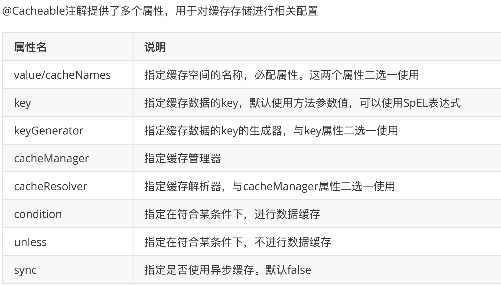


#### 5.2 常用注解说明

​	1. **@EnableCaching**

​		常用于主程序类。用于开启基于注解的缓存支持

​	2. **@Cacheable**

​		可以作用于类或方法上（通常用于数据查询接口上）。用于对方法查询结果进行缓存。

​		执行流程是先到缓存中查询结果，如果存在则返回，没有则查询并将结果放入缓存

​	3. **@CachePut**

​		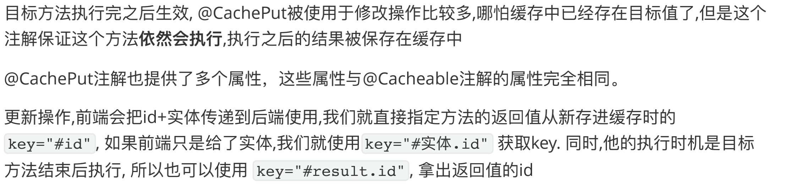

​	4. **@CacheEvict**

​		由spring框架提供。作用于类或者方法上（通常用于删除方法上）。该注解的作用就是删除缓存数据。

​		执行顺序为 先进行方法调用，然后将缓存进行清除。

